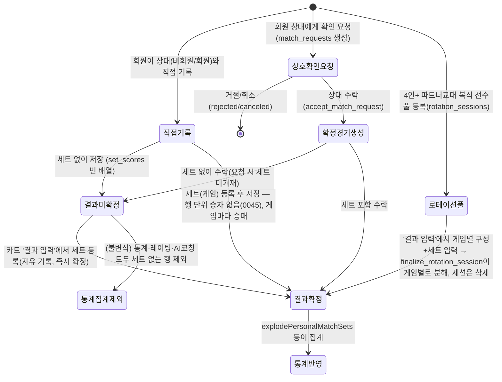
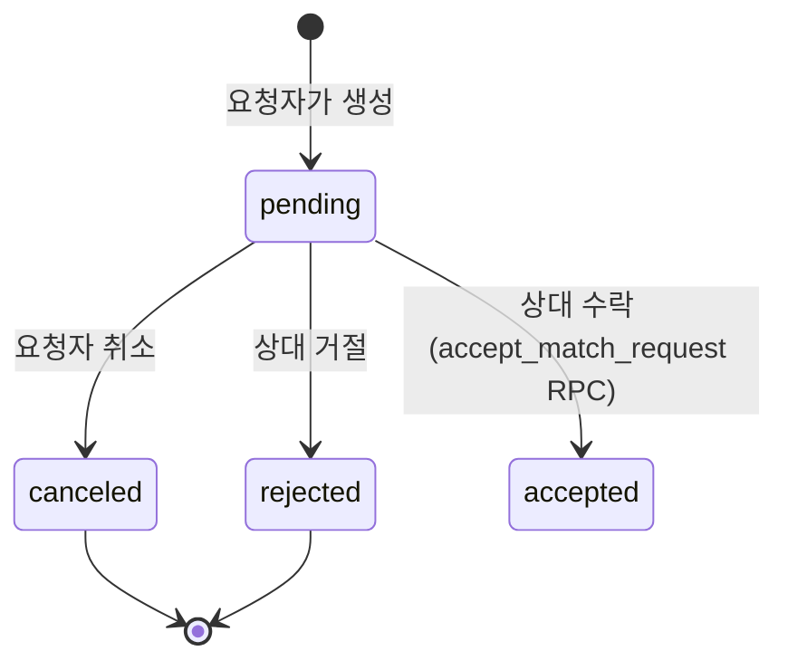
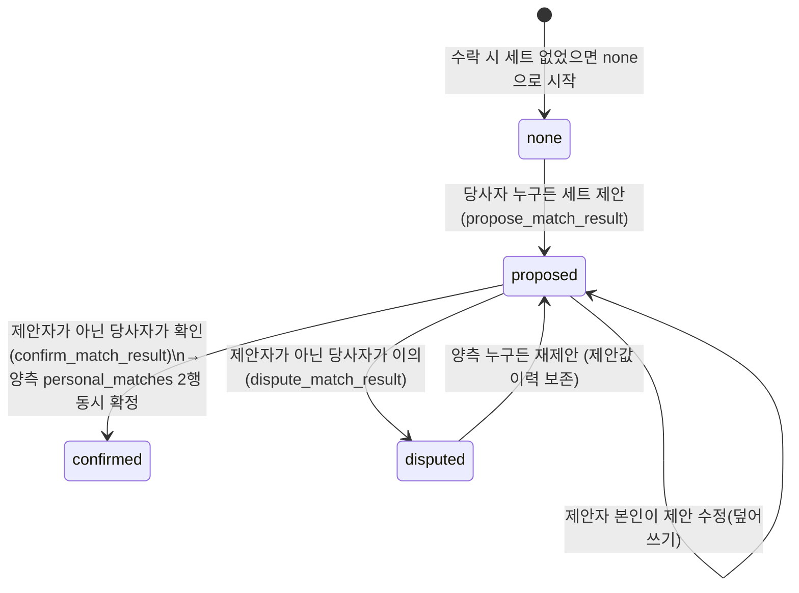
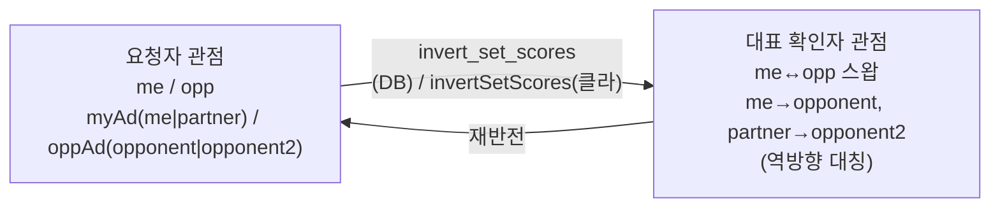
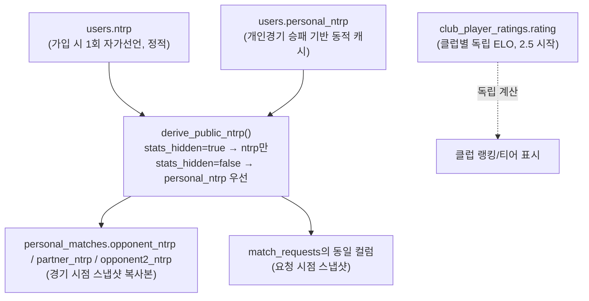
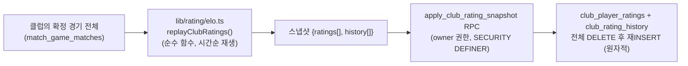

# 도메인/상태 모델 (재설계 Step 1)

> DB 재설계(회원가입/인증 제외 전체 초기화)를 위한 화면-독립적 도메인 모델. CLAUDE.md "도메인 어휘" 표를 상태 다이어그램 수준으로 확장한 문서. 여기 정의된 상태·불변식이 Step2(정적 UI)·Step3(신규 ERD)의 공통 기준이 된다.
>
> 사실은 `supabase/migrations/0033·0037·0038`, `docs/rating-system.md`, `CLAUDE.md`에서 확인한 현재 구현 근거를 기반으로 작성했다. 재설계안 자체는 이 문서의 결론이 아니라 Step3(ERD)에서 확정한다 — 여기서는 "현재 시스템이 실제로 하는 일"을 화면과 무관하게 정리하는 것이 목적이다.

## 1. Match 라이프사이클 (경기 하나의 전체 여정)

경기는 **출처(source)** 가 3갈래이고, 출처에 따라 확정 방식이 다르다. 이 갈래가 현재 `personal_matches`(source_request_id 유무), `match_requests`, `rotation_sessions` 3개 테이블에 흩어져 있다.

**출처별 차이 (현재 구현)**

| 출처 | 등록 시점 | 확정 트리거 | 수정/삭제 | 저장 위치 |
|---|---|---|---|---|
| 직접기록 | 즉시 `personal_matches` insert | 본인이 세트 입력 시 즉시 확정 | 본인 자유 | `personal_matches` (source_request_id NULL) |
| 상호확인요청 | `match_requests` insert (pending) | 수락 시 양측 2행 생성, 이후 결과 확정은 §2 참조 | RESTRICTIVE 정책으로 잠금 (본인도 수정 불가) | `personal_matches` (source_request_id NOT NULL) + `match_requests` |
| 로테이션풀 | `rotation_sessions` insert (선수풀만) | `finalize_rotation_session`이 게임별로 즉시 확정 상태로 분해 | 세션 자체는 삭제 후 재등록만 가능(UPDATE 정책 없음), 분해된 게임은 자유기록과 동일 | `rotation_sessions` → 분해 후 `personal_matches`(source_request_id NULL) |

## 2. Confirmation / Dispute 플로우 (상호확인 경기 전용)

`match_requests` 한 행이 **두 개의 독립적 상태 축**을 동시에 갖는다 — 이게 재설계에서 분리를 검토해야 할 핵심 지점이다.

**축 A — 요청 자체의 상태 (`status`)**

**축 B — 결과 협상 상태 (`result_status`, accepted 상태에서만 의미 있음)**

**규칙 (근거: 0037/0038 RPC 구현)**
- `proposed_set_scores`는 항상 **요청자(requester) 관점**으로 정규화 저장. 상대가 제안하면 RPC가 반전 후 저장.
- 제안자 본인은 자기 제안을 확인/이의 불가 (`cannot_confirm_own_proposal`/`cannot_dispute_own_proposal`).
- confirm 시 `personal_matches` 양측 행이 **정확히 1개씩** 갱신되지 않으면 트랜잭션 전체 롤백 (`personal_matches_missing`).
- 상대가 탈퇴(`deleted_at`)하면 제안 자체가 막힘 (`counterpart_deleted`) — 영구 미확정 방지 규칙은 없음(재설계 시 고려 대상).

## 3. 참가자 구성 (단식/복식 다형성)

현재 단식/복식은 **컬럼 존재 여부**로 구분된다(다형성-컬럼 안티패턴):

- `match_requests`/`personal_matches`: `partner_*`(4컬럼) + `opponent2_*`(4컬럼)가 단식이면 전부 NULL, 복식이면 필수(CHECK로 강제)
- `match_game_matches`(클럽 대진표): `player1_id/player2_id`(단식) vs `team1/team2` + `team1_ad_player_id/team2_ad_player_id`(복식)가 상호배타 공존

**복식 대표 확인자 규칙** (`resolveConfirmRep`, 0038): 상대팀 2명 중 회원인 사람이 `opponent_user_id`(대표)가 되고, 나머지(파트너 포함)는 회원이어도 그들의 `personal_matches`에는 레코드가 생기지 않는다 — "참가자 4명 중 실제로 기록을 갖는 사람은 요청자+대표 확인자 2명뿐"이라는 비대칭 규칙.

**애드/듀스(사이드) 반전** — 관점 변환 시 함께 반전되는 값:

현재 이 규칙이 **4곳에 개별 구현**되어 있음(CLAUDE.md 명시): DB `invert_set_scores`, 클라 `lib/personal-matches/perspective.ts`, `propose_match_result`의 정규화, `accept_match_request`의 저장 로직. 재설계 시 단일 소스로 통합할지가 Step3의 결정 사항.

## 4. NTRP(실력지표) — 4갈래 저장

**규칙**: 통계 비공개(`stats_hidden`) 유저는 동적 `personal_ntrp`를 절대 노출하지 않고 자가선언 `ntrp`만 스냅샷된다. 범위(1.0~7.0) 밖이면 스냅샷은 NULL.

## 5. 클럽 레이팅(ELO) 재계산 — "증분 갱신"이 아니라 "전체 리플레이"

레이팅은 트리거로 증분 갱신되지 않고, **owner가 재계산을 트리거할 때마다 클럽 전체 이력을 처음부터 재생**해 스냅샷으로 덮어쓴다. 재설계 시에도 이 "순수 계산 + 스냅샷 영속화" 분리 구조는 유지할 가치가 있는 패턴(불변식 후보).

## 6. 다형성 처리 원칙 (재설계 시 적용할 규칙)

1. **단식/복식**은 컬럼 nullable 조합이 아니라 참가자 목록(예: `match_participants` 1~4행, `role`: self/partner/opponent1/opponent2)으로 표현한다.
2. **경기 출처(직접기록/상호확인/로테이션)** 는 하나의 `source_type` enum + 참조 FK로 표현하고, 상태 전이(§1, §2)는 출처와 무관하게 공통 `result_status` 축으로 통일할 수 있는지 Step3에서 검토한다.
3. **상태머신은 상태 컬럼 1개 + 이력 테이블**로 표현한다 — 현재처럼 하나의 요청 행이 축 A(status)와 축 B(result_status)를 동시에 갖는 구조는 재설계 시 분리를 우선 검토한다(예: `match_requests`는 요청 원장만, 결과 협상은 `match_result_negotiations` 별도 테이블).
4. **스냅샷 컬럼**(opponent_ntrp 등)은 "기록 시점 값 보존"이 목적이면 유지하되, 명명 규칙(`*_snapshot`)으로 구분해 "현재값"과 혼동되지 않게 한다.

## 7. 불변식 목록 (현재 시스템이 실제로 지키는 규칙)

- 결과 미확정(`set_scores` 빈 배열) 경기는 통계·레이팅·AI 코칭 집계에서 전부 제외된다. 행 단위 승자 컬럼(`winner`, 세트 다수결)은 0045에서 폐기 — 세트 1개 = 게임 1개로 게임마다 승패를 본다.
- 상호확인으로 생성된 `personal_matches` 행(`source_request_id` NOT NULL)은 당사자 본인도 수정/삭제할 수 없다.
- 세트 스코어는 항상 요청자(생성자) 관점으로 정규화 저장되고, 조회 시점에 viewer 관점으로 반전된다.
- 제안자 본인은 자신이 제안한 결과를 확인(confirm)하거나 이의 제기할 수 없다.
- 복식 상호확인에서 파트너·상대2가 회원이어도 그들의 `personal_matches`에는 레코드가 생성되지 않는다 — 기록은 요청자와 대표 확인자 2명만 갖는다.
- 클럽 레이팅은 증분 갱신이 아니라 owner 트리거 시 전체 재계산(리플레이) 후 스냅샷 교체.
- 탈퇴 회원(`deleted_at`)과는 새로운 결과 제안이 불가능하다(기존 제안/확정 경기는 보존).

## 8. 재사용할 기존 자산 (Step2/3에서 그대로 활용)

| 자산 | 위치 | 재사용 이유 |
|---|---|---|
| 애드/듀스 반전 (클라 측) | `lib/personal-matches/perspective.ts` (`invertSetScores`) | DB `invert_set_scores`와 동일 규칙 — 재설계 후에도 규칙 자체는 불변 |
| 대표 확인자 결정 | `lib/personal-matches/confirm-flow.ts` (`resolveConfirmRep`) | §3 참가자 정규화 설계의 입력 규칙 |
| 필드별 NTRP 검증 스킵 | `lib/personal-matches/validate-input.ts` (`skipNtrpFor`) | 폼 검증 로직, 스키마 변경과 무관 |
| 세트 분해/집계 초크포인트 | `lib/personal-matches/explode.ts` | "미확정 제외" 불변식의 유일한 구현 지점 — 재설계 후에도 이 역할 유지 권장 |
| 레이팅 순수 엔진 | `lib/rating/elo.ts`, `personal-rating.ts`, `tier.ts` | §5 "순수계산+스냅샷 영속화" 분리 구조 유지 시 그대로 재사용 |
| 순수 함수 + vitest 패턴 | `lib/analytics/*` | 스키마 비의존적 집계 로직 — DB 재설계 영향 없음 |

---

**다음 단계**: 이 문서를 기준으로 Step2(clubs/match-games/personal-matches·match-requests/레이팅 4개 영역)의 정적 UI를 구현하며, 화면에서 여기 없는 데이터가 발견되면 이 문서를 갱신한다.
